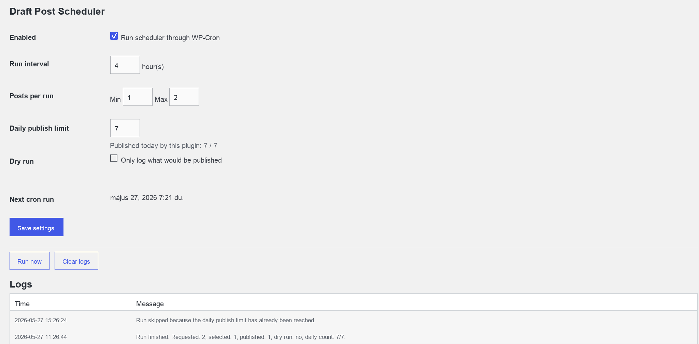

# WordPress Tools

A collection of WordPress plugins and tools.

## Build

Build a plugin zip from the command line:

```bash
./scripts/build-plugin.sh
```

The script lets you select:
- `thumbnail-manager`
- `post-scheduler`
- `tumblr-auto-reposter`
- `all`

You can also pass the plugin directly:

```bash
./scripts/build-plugin.sh tumblr-auto-reposter
./scripts/build-plugin.sh all
```

## Plugins

### Thumbnail Manager

A WordPress admin tool to view and generate post featured images using the Pexels API.

**Features:**
- View all posts with their current featured images in a grid layout
- Search and select images from Pexels directly from the WordPress admin
- Generate or regenerate featured images for any post
- Choose from multiple image sizes (small, medium, large, large2x, original)
- Automatic image download and attachment to WordPress media library
- Photo credit attribution included in image metadata

**Requirements:**
- WordPress 5.0 or higher
- PHP 7.0 or higher
- Free Pexels API key ([Get one here](https://www.pexels.com/api/))

**Installation:**
1. Download the latest release from the [Releases](https://github.com/atosz33/wordpress-tools/releases) page
2. Upload the plugin zip file through WordPress admin (Plugins → Add New → Upload Plugin)
3. Activate the plugin
4. Go to Thumbnail Manager → Settings and add your Pexels API key

**Usage:**
1. Navigate to Thumbnail Manager in the WordPress admin menu
2. Click "Generate" on any post without a featured image, or "Regenerate" to replace an existing one
3. Enter a search query (e.g., "nature", "technology", "business")
4. Browse the search results and click on an image
5. Select your preferred image size
6. The image will be automatically downloaded, added to your media library, and set as the featured image

**Screenshots:**


**Version:** 1.1

---

### Draft Post Scheduler

A WordPress admin tool to publish draft posts automatically through WP-Cron with configurable limits and visible run logs.

**Features:**
- Enable or disable scheduled publishing from the WordPress admin
- Run the scheduler at a configurable hourly interval
- Publish a randomized number of draft posts per run using minimum and maximum limits
- Enforce a daily publish limit to prevent too many posts going live in one day
- Use dry run mode to log what would be published without changing post statuses
- Trigger manual runs and review scheduler logs from the settings page

**Requirements:**
- WordPress 5.8 or higher
- PHP 7.4 or higher

**Installation:**
1. Download the latest release from the [Releases](https://github.com/atosz33/wordpress-tools/releases) page
2. Upload the plugin zip file through WordPress admin (Plugins → Add New → Upload Plugin)
3. Activate the plugin
4. Go to Settings → Draft Scheduler and configure the scheduler

**Usage:**
1. Navigate to Settings → Draft Scheduler in the WordPress admin menu
2. Enable the scheduler and set the run interval in hours
3. Configure the minimum and maximum number of posts to publish per run
4. Set a daily publish limit
5. Use dry run mode for testing, or click "Run now" to trigger a manual scheduler run
6. Review the log table to see published posts, skipped runs, and daily limit activity

**Screenshots:**



**Version:** 1.0.0

---

### Tumblr Auto Reposter

A WordPress admin tool to repost article images to Tumblr automatically through WP-Cron.

**Features:**
- Connect Tumblr through OAuth using your own Tumblr app consumer key and secret
- Displays the callback URL required by Tumblr app setup
- Randomly selects one WordPress article and one image from that article per run
- Creates Tumblr photo posts with the selected image, linked article title, and article URL
- Configurable daily Tumblr post limit
- Configurable image cooldown so the same image is not reused for X days
- Supports featured images, attached media images, and images embedded in article content
- Supports Tumblr queue, published, draft, and private states
- Dry run mode, manual run button, image cooldown clearing, and admin logs

**Requirements:**
- WordPress 5.8 or higher
- PHP 7.4 or higher
- Tumblr app consumer key and secret

**Installation:**
1. Upload the `tumblr-auto-reposter` folder through WordPress admin or copy it to `/wp-content/plugins/`
2. Activate the plugin
3. Go to Settings -> Tumblr Reposter
4. Copy the displayed callback URL into your Tumblr app settings
5. Save the Tumblr consumer key, consumer secret, and target blog hostname
6. Click Connect Tumblr and authorize the app
7. Configure daily post count, cooldown, post state, image sources, and dry run mode

**Version:** 1.0.0

---
